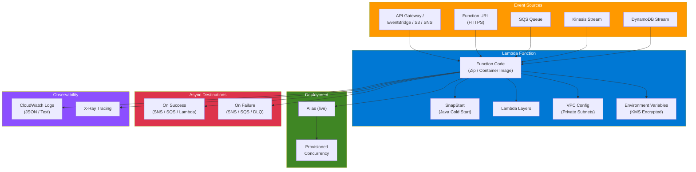

# terraform-aws-lambda

Production-grade Terraform module for deploying AWS Lambda functions with comprehensive support for packaging, layers, SnapStart, function URLs, event source mappings, canary deployments, and observability.

## Architecture Diagram



## Architecture

```
                                    +-------------------+
                                    |   API Gateway /   |
                                    |   EventBridge /   |
                                    |   S3 / SNS / etc  |
                                    +--------+----------+
                                             |
                                    Lambda Permission
                                             |
                                             v
+------------------+           +----------------------------+           +------------------+
|   Event Source   |---------->|      Lambda Function       |---------->|   Destinations   |
|   SQS / Kinesis  |  mapping  |                            |  async    |   SNS / SQS /    |
|   DynamoDB       |           |  - Zip / Image packaging   |  invoke   |   Lambda / EBus  |
+------------------+           |  - SnapStart (Java)        |           +------------------+
                               |  - VPC attachment          |
                               |  - X-Ray tracing           |
                               |  - Env var encryption      |
                               +------+----------+----------+
                                      |          |
                              +-------+--+  +----+----------+
                              |  Alias   |  |  CloudWatch   |
                              |  (live)  |  |  Log Group    |
                              +----+-----+  +---------------+
                                   |
                          +--------+---------+
                          |   Provisioned    |
                          |   Concurrency    |
                          +------------------+
```

## Features

- **Flexible packaging**: Local Zip (via `archive_file`), S3, or container image (ECR)
- **SnapStart**: First-class support for Java cold start optimization
- **Function URLs**: HTTPS endpoints with configurable CORS and auth
- **Event source mappings**: SQS, DynamoDB Streams, Kinesis with filter criteria
- **Async destinations**: Route success/failure to SNS, SQS, Lambda, or EventBridge
- **Canary deployments**: Alias-based deployments with provisioned concurrency
- **VPC integration**: Deploy functions inside private subnets
- **Observability**: X-Ray tracing, structured JSON logging, configurable log retention
- **Security**: KMS encryption for environment variables and logs, dead letter queues
- **IAM**: Least-privilege execution role with conditional policies

## Usage

### Basic

```hcl
module "lambda" {
  source  = "kogunlowo123/lambda/aws"
  version = "1.0.0"

  function_name = "my-api-handler"
  runtime       = "python3.12"
  handler       = "handler.handler"
  source_path   = "${path.module}/src"

  tags = {
    Environment = "production"
  }
}
```

### With Function URL

```hcl
module "lambda" {
  source  = "kogunlowo123/lambda/aws"
  version = "1.0.0"

  function_name          = "my-url-handler"
  runtime                = "nodejs20.x"
  handler                = "index.handler"
  source_path            = "${path.module}/src"
  enable_function_url    = true
  function_url_auth_type = "NONE"

  cors_config = {
    allow_origins = ["https://example.com"]
    allow_methods = ["GET", "POST"]
    max_age       = 3600
  }
}
```

### With SQS Event Source

```hcl
module "lambda" {
  source  = "kogunlowo123/lambda/aws"
  version = "1.0.0"

  function_name = "sqs-processor"
  runtime       = "python3.12"
  handler       = "handler.handler"
  source_path   = "${path.module}/src"

  event_source_mappings = [
    {
      event_source_arn    = aws_sqs_queue.source.arn
      batch_size          = 10
      function_response_types = ["ReportBatchItemFailures"]
      filter_criteria = [
        { pattern = jsonencode({ body = { type = ["order"] } }) }
      ]
    }
  ]
}
```

### With SnapStart (Java)

```hcl
module "lambda" {
  source  = "kogunlowo123/lambda/aws"
  version = "1.0.0"

  function_name    = "java-handler"
  runtime          = "java21"
  handler          = "com.example.Handler::handleRequest"
  s3_bucket        = "deployment-bucket"
  s3_key           = "handler.jar"
  enable_snapstart = true
  alias_name       = "live"
}
```

## Requirements

| Name | Version |
|------|---------|
| terraform | >= 1.5.0 |
| aws | >= 5.20.0 |
| archive | >= 2.4 |

## Inputs

| Name | Description | Type | Default | Required |
|------|-------------|------|---------|----------|
| function_name | Unique name for the Lambda function | `string` | n/a | yes |
| description | Description of the Lambda function | `string` | `""` | no |
| runtime | Runtime environment (e.g., python3.12, nodejs20.x, java21) | `string` | `null` | no |
| handler | Function entrypoint (e.g., index.handler) | `string` | `null` | no |
| architectures | CPU architecture (x86_64 or arm64) | `list(string)` | `["arm64"]` | no |
| memory_size | Memory allocation in MB (128-10240) | `number` | `128` | no |
| timeout | Max execution time in seconds (1-900) | `number` | `30` | no |
| reserved_concurrent_executions | Reserved concurrency (-1 for unreserved) | `number` | `-1` | no |
| source_path | Local path to function source code | `string` | `null` | no |
| s3_bucket | S3 bucket for deployment package | `string` | `null` | no |
| s3_key | S3 key for deployment package | `string` | `null` | no |
| s3_object_version | S3 object version for deployment package | `string` | `null` | no |
| image_uri | ECR image URI for container deployment | `string` | `null` | no |
| package_type | Deployment package type (Zip or Image) | `string` | `"Zip"` | no |
| layers | List of Lambda layer ARNs (max 5) | `list(string)` | `[]` | no |
| environment_variables | Environment variables map | `map(string)` | `{}` | no |
| enable_function_url | Create a Lambda function URL | `bool` | `false` | no |
| function_url_auth_type | Auth type for function URL (NONE or AWS_IAM) | `string` | `"AWS_IAM"` | no |
| cors_config | CORS configuration for function URL | `object` | `null` | no |
| enable_snapstart | Enable SnapStart (Java runtimes) | `bool` | `false` | no |
| vpc_config | VPC configuration (subnet_ids, security_group_ids) | `object` | `null` | no |
| enable_xray_tracing | Enable X-Ray tracing | `bool` | `true` | no |
| tracing_mode | X-Ray tracing mode (Active or PassThrough) | `string` | `"Active"` | no |
| log_retention_days | CloudWatch log retention in days | `number` | `30` | no |
| log_format | Log format (Text or JSON) | `string` | `"Text"` | no |
| event_source_mappings | Event source mapping configurations | `list(object)` | `[]` | no |
| on_success_arn | Destination ARN for successful async invocations | `string` | `null` | no |
| on_failure_arn | Destination ARN for failed async invocations | `string` | `null` | no |
| provisioned_concurrency | Provisioned concurrent executions (0 to disable) | `number` | `0` | no |
| alias_name | Lambda function alias name | `string` | `null` | no |
| alias_description | Lambda function alias description | `string` | `""` | no |
| kms_key_arn | KMS key ARN for encryption | `string` | `null` | no |
| dead_letter_target_arn | ARN for dead letter queue (SNS or SQS) | `string` | `null` | no |
| allowed_triggers | Map of allowed triggers for Lambda permissions | `map(object)` | `{}` | no |
| tags | Tags to apply to all resources | `map(string)` | `{}` | no |

## Outputs

| Name | Description |
|------|-------------|
| function_name | Name of the Lambda function |
| function_arn | ARN of the Lambda function |
| invoke_arn | ARN for API Gateway invocation |
| qualified_arn | Qualified ARN with version |
| function_url | Function URL endpoint |
| alias_arn | ARN of the Lambda alias |
| role_arn | ARN of the execution IAM role |
| role_name | Name of the execution IAM role |
| log_group_arn | ARN of the CloudWatch log group |
| log_group_name | Name of the CloudWatch log group |

## Security Considerations

- **Least-privilege IAM**: The execution role only includes permissions required by the configured features (VPC, X-Ray, event sources, KMS, dead letter)
- **KMS encryption**: Environment variables and CloudWatch logs can be encrypted with a customer-managed KMS key
- **Dead letter queues**: Failed async invocations and event source processing failures can be routed to SQS or SNS
- **VPC isolation**: Functions can be deployed inside private subnets with security group controls
- **Function URL auth**: Use `AWS_IAM` auth type for production workloads; `NONE` exposes the endpoint publicly
- **Reserved concurrency**: Set `reserved_concurrent_executions` to limit blast radius and prevent runaway costs
- **No wildcard IAM**: Event source permissions are scoped to specific resource ARNs

## Cost Estimation

Lambda pricing depends on several factors:

| Component | Pricing Model |
|-----------|--------------|
| Requests | $0.20 per 1M requests |
| Duration | $0.0000166667 per GB-second (arm64) |
| Provisioned concurrency | $0.0000041667 per GB-second + $0.000000463 per request |
| Function URL | No additional charge (same as Lambda pricing) |
| Data transfer | Standard AWS data transfer rates |
| CloudWatch Logs | $0.50 per GB ingested |

arm64 functions are approximately 20% cheaper than x86_64 for duration-based pricing.

## Examples

- [Basic](examples/basic/) - Lambda with API Gateway trigger
- [Advanced](examples/advanced/) - Lambda with SQS, VPC, layers, and dead letter queue
- [Complete](examples/complete/) - Full-featured Lambda with SnapStart, function URL, destinations, and canary alias

## References

- [AWS Lambda Developer Guide](https://docs.aws.amazon.com/lambda/latest/dg/welcome.html)
- [Lambda Function URLs](https://docs.aws.amazon.com/lambda/latest/dg/lambda-urls.html)
- [Lambda SnapStart](https://docs.aws.amazon.com/lambda/latest/dg/snapstart.html)
- [Lambda Event Source Mappings](https://docs.aws.amazon.com/lambda/latest/dg/invocation-eventsourcemapping.html)
- [Lambda Destinations](https://docs.aws.amazon.com/lambda/latest/dg/invocation-async.html#invocation-async-destinations)
- [Terraform AWS Provider - Lambda](https://registry.terraform.io/providers/hashicorp/aws/latest/docs/resources/lambda_function)

## License

MIT License. See [LICENSE](LICENSE) for full details.
